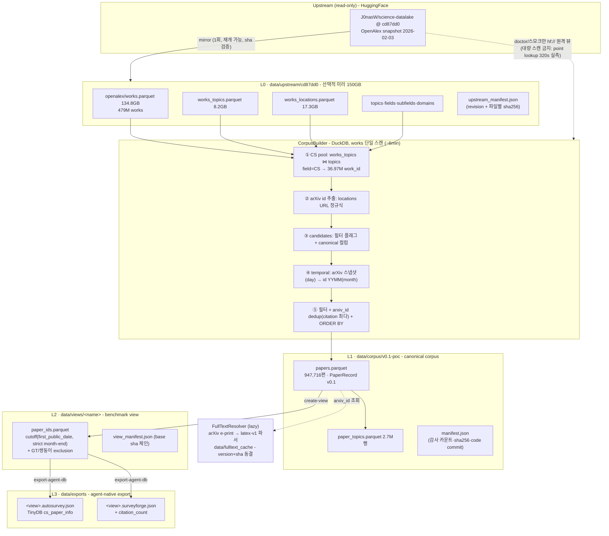
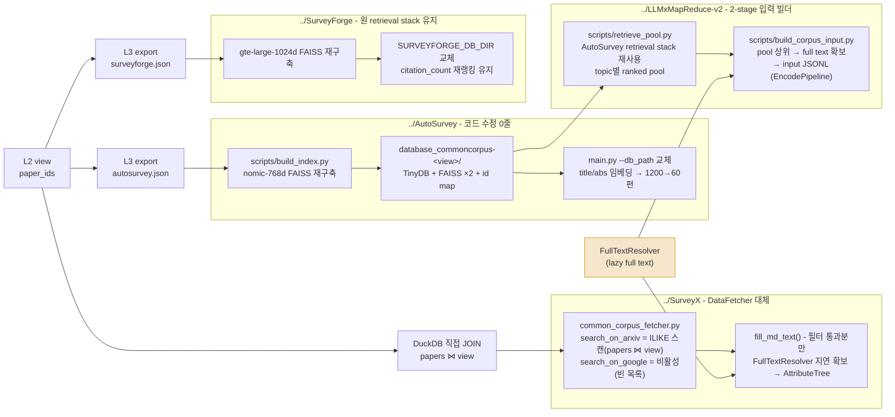

# asg-common-corpus

**여러 Automated Survey Generation(ASG) agent가 동일한 논문 universe 위에서 동작하도록 만드는 공통 검색 코퍼스.**

[The Science Data Lake](https://arxiv.org/abs/2603.03126) (Wilinski, 2026)를 read-only upstream으로 사용해
Computer Science 논문의 canonical metadata corpus를 로컬에 고정(snapshot)하고,
benchmark별 cutoff/GT-제외 view와 agent별 DB 포맷 export까지 제공한다.

대상 agent: **AutoSurvey · SurveyForge · SurveyX · LLM×MapReduce-V2**

---

## 1. 왜 필요한가

ASG agent들은 각자 다른 corpus(수집 시점·범위·metadata 품질이 제각각)를 쓴다. 이 상태로 성능을 비교하면
**agent 구조가 좋은 것인지, 논문 풀이 좋은 것인지** 분리할 수 없다. 이 프로젝트는 다음을 공통화한다.

1. 동일한 검색 가능 논문 universe
2. 동일한 cutoff 정책 (`first_public_date` 기준)
3. 동일한 canonical metadata (`PaperRecord v0.1`)
4. 동일한 paper identity (OpenAlex W-id + arXiv base id)
5. corpus snapshot의 재현 가능성 (전 단계 manifest + sha256 체인)

반면 각 agent의 retrieval·임베딩·outline·memory 등 고유 처리는 그대로 둔다.
**핵심 설계 원칙: Metadata-first + Lazy Full-text Resolution** - 검색은 title/abstract metadata로 하고,
full text는 실제로 선택된 논문만 사후에 획득·동결한다.

## 2. Science Data Lake에서 차용한 것 / 하지 않은 것

Science Data Lake는 8개 학술 소스(OpenAlex, S2AG, SciSciNet, PwC 등)를 DOI 정규화로 통합한
~960GB Parquet + DuckDB 뷰 인프라다(293M papers). 본 프로젝트가 차용한 것:

| 차용 | 내용 |
|---|---|
| **데이터 소스** | `openalex.*` 스키마만 (works 479M, works_topics, works_locations, topics 계층). CC0라 보관·재배포 제약 없음 |
| **접근 방식** | views-over-Parquet + DuckDB. HuggingFace 배포판(`J0nasW/science-datalake`)을 원격 attach 하거나 로컬 미러에 동일 뷰명으로 attach |
| **snapshot 규율** | dataset revision pinning (우리 pin: `cd87dd0…`, OpenAlex snapshot **2026-02-03**) - `latest`를 암묵적으로 쓰지 않는다 |
| **전처리 결과** | abstract 평문(inverted index 아님), `valid_title_abstract` 품질 플래그, topic 4계층(domain→field→subfield→topic) |

차용하지 **않은** 것과 그 이유:

| 미차용 | 이유 |
|---|---|
| S2AG / SciSciNet / RoS / xref.unified_papers | v1 정책: metadata·citation·topic 모두 OpenAlex 단일 소스. S2AG는 HF 배포판에 미포함(라이선스)이기도 함 |
| 960GB 전체 로컬 설치 | 불필요. 빌더가 읽는 4개 테이블 ≈ **150GB만 선택적 미러** (아래 §3) |
| 원격 쿼리 상시 사용 | **실측상 불가능한 개발 방식** - works.parquet(134.8GB)는 id 정렬이 없어 어떤 필터도 전체 스캔이고, 원격 point lookup 320s / 8GB 필터 스캔 20분+ 이었다. 원격은 `doctor`·스모크 전용 |
| arXiv 카테고리 | Science Data Lake에 없음. CS 정의는 OpenAlex field로 통일(§5 D1). arXiv id는 `works_locations`의 URL에서 추출(`works_ids`에는 arXiv 컬럼이 없음) |

## 3. DB 아키텍처

```
HuggingFace: J0nasW/science-datalake @ cd87dd0  (read-only upstream)
        │  1회 선택적 미러 (150GB, sha256 검증, 재개 가능)
        ▼
[L0] data/upstream/cd87dd0/            openalex/{works, works_topics, works_locations, topics…}.parquet
        │                              + upstream_manifest.json
        │  CorpusBuilder: CS pool(topic) → arXiv id 추출 → 필터 → dedup → temporal 해상
        ▼                               (works 1회 스캔, 전 필터 단계 감사 카운트 - 무음 폐기 금지)
[L1] data/corpus/v0.1-poc/             papers.parquet (947,716편, PaperRecord v0.1)
        │                              paper_topics.parquet (2.7M행) + manifest.json
        │  CorpusView: cutoff(first_public_date) + GT version-family 제외
        ▼
[L2] data/views/<name>/                paper_ids.parquet + view_manifest.json
        │                              (물리 복사 없음; --materialize 옵션 시에만 full copy)
        │  export-agent-db
        ▼
[L3] data/exports/<view>.<agent>.json  agent 원 포맷 (TinyDB "cs_paper_info") + manifest
        │
        ▼
     각 agent가 자기 도구로 임베딩/FAISS 빌드 → --db_path 교체 (agent 코드 수정 0줄)

[별도 축] FullTextResolver - 선택된 논문만 arXiv e-print lazy fetch
          → data/fulltext_cache/arxiv/<id>/{text.txt, metadata.json}  (version+sha256 동결)
```

### L1 `PaperRecord v0.1` (papers.parquet 주요 컬럼)

| 그룹 | 컬럼 |
|---|---|
| identity | `paper_id`(=OpenAlex W-id) · `openalex_id` · `doi`(정규화) · `arxiv_id`(버전 없는 base) · `version_family_id` |
| content | `title` · `abstract` · `language` |
| temporal | `first_public_date` · `publication_date` · `date_source`(arxiv_snapshot/arxiv_id/openalex) · `date_precision`(day/month) |
| impact | `citation_count`(OpenAlex, snapshot 2026-02-03 고정) |
| provenance | `metadata_source` · `source_snapshot` · full-text hint |

`first_public_date` 해상 규칙(우선순위): ① 로컬 arXiv 스냅샷 날짜 - 단 **id에 인코딩된 연월(YYMM)과
같은 달일 때만** day 정밀도로 채택(v2+ 날짜 혼입 방지) ② id 연월(month 정밀도) ③ OpenAlex fallback.
month 정밀도는 view의 cutoff 판정에서 **월말 기준(strict)** 으로 비교해 temporal leakage를 막는다.

### 빌드 파이프라인 상세 (SQL/스크립트 단위)

L1 빌드(`common_corpus.cli build`)는 5개 SQL 스테이지를 한 DuckDB 세션에서 순차 실행한다.
모든 스테이지는 소요 시간과 폐기 건수를 manifest에 남긴다 (무음 폐기 금지).

| 순서 | SQL / 모듈 | 하는 일 | 실측 (warm) |
|---|---|---|---|
| 1 | `sql/build_cs_pool.sql` | `works_topics ⋈ topics(field=CS)` → CS work_id 36.97M | 2 s |
| 2 | `sql/extract_arxiv_ids.sql` | `works_locations` URL 정규식 → work당 arXiv base id 1개(min 결정적, 충돌 797건 기록) | 6~40 s |
| 3 | `sql/build_candidates.sql` | **works.parquet 단일 스캔**으로 후보 temp table (canonical 컬럼 + 필터 플래그, publication_date VARCHAR→DATE 캐스팅) | 36~260 s |
| 4 | `sql/resolve_temporal.sql` | arXiv 스냅샷 날짜(id 연월과 같은 달일 때만 day) + id 연월(month) 결합 | 0.3 s |
| 5 | `sql/build_papers.sql` | 필터(valid/en/clean/arXiv) → **arxiv_id별 dedup**(citation 최다, QUALIFY) → ORDER BY 결정적 출력 | 2 s |
| 6 | `sql/build_topics.sql` | 선정 논문의 paper_topics relation | 9~47 s |

주요 모듈/스크립트:

| 파일 | 역할 |
|---|---|
| `src/common_corpus/providers/science_lake.py` | `ScienceLakeClient` - hf:// 원격 / 로컬 미러를 같은 뷰명으로 attach |
| `src/common_corpus/builders/mirror.py` | 선택적 미러: 재개 가능 다운로드 + HF LFS sha256 검증 + upstream_manifest |
| `src/common_corpus/builders/corpus_builder.py` | L1 오케스트레이션 + 감사 카운트 + manifest 생성 |
| `src/common_corpus/corpus/view.py` | L2 CorpusView - cutoff(strict month-end)·GT 제외·불변식 검증 |
| `src/common_corpus/fulltext/{providers,parser,resolver}.py` | arXiv e-print(LaTeX tar/단일/PDF) → latex-v1 파서 → 캐시 freeze |
| `src/common_corpus/integrations/survey_search.py` | L3 export - agent TinyDB(`cs_paper_info`) 포맷 생성 |
| `scripts/run_detached.sh` | setsid nohup 실행 (SSH 무관), logs/에 로그·pid |
| `scripts/audit_coverage.py` | GT(SurveyBench·SurGE) reference coverage 감사 |
| `scripts/extract_gt_refs.py` | 후보 GT ref 추출: S2 API → arXiv .bbl/.bib → Crossref 3단 fallback |
| `scripts/audit_candidates.py` | 후보 감사: post-cutoff·eligible(이중 키 매칭)·D1·쌍둥이 탐지 |


### 시각화 - DB 계층·쿼리 흐름 (Mermaid)



단계별 한 줄 설명:

| 단계 | 무엇을 하는가 |
|---|---|
| Upstream | HuggingFace의 Science Data Lake를 revision 고정 상태로 읽기 전용 사용 |
| L0 미러 | 빌더가 읽는 4종 테이블만 1회 내려받아 sha256 검증 후 보관. 이후 모든 작업은 로컬 |
| CorpusBuilder | DuckDB로 works를 한 번만 스캔하며 CS 필터, arXiv id 추출, 날짜 해상, 중복 제거를 수행 |
| L1 corpus | 검색 가능한 논문 universe의 확정본. 모든 agent가 공유하는 canonical metadata |
| L2 view | 실험별 cutoff와 GT 제외만 적용한 논리적 부분집합. 물리 복사 없음 |
| L3 export | 각 agent가 원래 읽던 파일 포맷으로 변환한 출력 |
| FullTextResolver | 검색 이후 실제 선택된 논문만 원문을 받아 버전과 해시를 고정 저장 |

### 시각화 - 4개 ASG Agent의 adaptation (Mermaid)

각 agent는 **retrieval·임베딩 스택을 원형 그대로 유지**하고, 입력 데이터만 Common Corpus view로 교체한다.



Agent별 한 줄 설명: AutoSurvey는 DB 경로만 바꾸고, SurveyForge는 DB 디렉터리만 바꾸며,
SurveyX는 검색 클래스 하나를 corpus 조회로 대체하고, LLM×MapReduce-V2는 입력 파일을
corpus에서 생성해 넣는다. 네 경우 모두 agent의 검색·생성 로직 자체는 손대지 않는다.

Agent별 요점:
| Agent | 교체 지점 | 유지되는 고유 스택 | full text |
|---|---|---|---|
| AutoSurvey | `--db_path` (0줄) | nomic 임베딩, RAG-outline-draft 파이프라인 | 불필요 (abstract만) |
| SurveyForge | DB 디렉터리 env | gte 임베딩, citation rerank, outline DB | 불필요 |
| SurveyX | DataFetcher 1클래스 | 키워드 recall→임베딩 필터, AttributeTree | resolver로 lazy (md_text) |
| LLM×MapReduce-V2 | 입력 JSONL 빌더 | encode→map→reduce 파이프라인 | pool 전체 resolver 확보 |

### 재현성: manifest 체인

```
agent run  →  export manifest  →  view_manifest  →  corpus manifest  →  upstream_manifest
              (content sha)       (cutoff·제외·sha)   (감사·sha·commit)    (HF revision·파일 sha)
```

동일 upstream revision + config + code commit ⇒ 동일 sha256 (2회 빌드로 검증됨).
빌드의 모든 필터 단계는 폐기 건수를 manifest에 남긴다 (예: pool 36.97M → valid 19.51M → arXiv 보유
1.01M → dedup 후 947,716).

## 4. 실측 근거 수치

| 항목 | 값 |
|---|---|
| corpus (arXiv-backed CS, en, valid abstract) | **947,716편** (1967~2026-02) |
| coverage | DOI 93.0% · abstract/arXiv 100% · first_public_date 100% (day 53% / month 47%) |
| GT reference 커버리지 | **SurveyBench 95.2% · SurGE 94.9%** (topic 평균; 미수록 주원인은 arXiv cs.* ↔ OpenAlex field 분류 불일치 ~4%) |
| 전체 빌드 시간 | 미러 후 로컬에서 ~6분 (cold) / ~1분 (warm) |
| 미러 비용 | 150GB, 1회 ~2.5h (HF ~18MB/s), sha256 전수 검증 |

## 5. 주요 설계 결정 (요약)

- **D1 - CS scope**: OpenAlex `field = Computer Science` ∧ arXiv 링크 보유. arXiv cs.* 세계의 약 84%를
  담으며, GT 기준 분류 불일치 유실이 topic 평균 4%대(임계 10% 미달)라 유지 확정
- **D2 - temporal**: 위 §3의 해상 규칙 + strict month cutoff
- **D3 - agent 연결**: 어댑터 계층 없이 **agent 원 DB 포맷을 직접 생성**, agent는 입력 경로만 교체.
  임베딩 모델은 agent별 통제 변수로 유지(공통화하지 않음)
- **D4 - 저-arXiv 후보**: corpus는 불변, 문제는 **topic 선정층에서** 해결. broader-CS(19.6M편) 전환은
  full-text agent가 비-arXiv 논문을 처리할 수 없어 agent 간 조건 비대칭이 생기므로 보류
- **D5/D6/D9 - 도메인**: arXiv-활성 하위영역 기준으로 재정의 → 최종 **ai · db · security · systems · network**.
  algorithm·se는 후보 부족으로 보류(데이터 보존)
- **D7 - 평가 기준**: "커버리지 최대화"가 아니라 **easy case 회피**. 후보 풀 대비 정답 비율
  0.07~0.76%로 검색 난이도를 확인했고, GT 인용문헌의 corpus 수동 추가는 하지 않는다
  (비-arXiv 논문이 corpus에 0편이라 추가 시 "arXiv에 없음 = 정답"이 성립)
- **D8 - full text**: corpus는 메타데이터만 보유. 비-arXiv 인용문헌 5,692편 중 PDF 확보 가능 25%,
  cc-by 635편 — 라이선스보다 **수집 채널의 부재**가 1차 제약
- **dedup**: 같은 arXiv 논문의 복수 OpenAlex work(6.6%)는 citation 최다 기준 결정적으로 1건 채택

## 6. 벤치마크 인스턴스 `bench-2512`

4개 agent를 비교할 **평가 세트**다. topic을 먼저 정하지 않고, cutoff 이후 publish된 human survey를
먼저 찾아 그 reference가 corpus에서 재현 가능한지 자동 감사로 판정한 뒤 주제를 역산했다.

```
후보 105편 등록 (Crossref 15개 저널 2026년분 + OpenAlex API + arXiv)
   │  자동 게이트: post-cutoff < 15% ∧ eligible coverage >= 50% ∧ eligible >= 60편
   ▼
○ 33편 → 도메인당 5편 선정 = 최종 25 topics (5 domains x 5)
   │
   ▼
view bench-2512 : 947,716 → cutoff 947,464 → GT 쌍둥이 제외 947,451편
```

| 산출물 | 내용 |
|---|---|
| `candidates/GT-SURVEYS.md` | 최종 25편의 **topic(agent 입력 문자열)** · GT 제목 · venue · 링크 · recall ceiling |
| `candidates/SELECTION.md` | 선정 근거, 도메인별 수치, 난이도 공변량, 보류 도메인 재개 조건 |
| `candidates/gt_exclude.txt` | view 제외 15 id (GT 본체 2 + preprint 쌍둥이 13) |
| `candidates/<domain>/<slug>/` | 후보 1건 = `candidate.yaml` + `refs.json`(GT 인용문헌, 채점 분모) |
| `data/audit/candidates_report.json` | 105편 전수 감사 원본 |

도메인별 통과 현황(감사/○): ai 8/8 · db 22/7 · security 11/5 · systems 22/5 · network 22/3 ·
algorithm 8/3(보류) · se 12/2(보류).

**topic별 recall ceiling(25~89%)을 결과표에 반드시 병기할 것** — GT 인용문헌 중 corpus에
존재하는 비율이 agent 점수의 상한이다. 탈락 후보의 refs.json과 감사 결과는 삭제하지 않는다
(탈락 사유가 벤치마크 문서의 근거).

## 7. 사용법

환경: conda env `asg-corpus` (python 3.11 + duckdb/pyarrow/pydantic/typer/huggingface_hub), `pip install -e .`

```bash
PY=/data2/chanjoong/miniforge3/envs/asg-corpus/bin/python

$PY -m common_corpus.cli doctor                 # 원격 연결·미러 상태 점검
scripts/run_detached.sh mirror                  # L0: 선택적 미러 (1회, SSH 끊겨도 진행, logs/)
scripts/run_detached.sh build --config config/corpus.yaml   # L1: corpus 빌드
$PY -m common_corpus.cli create-view --name bench-2512 \
    --cutoff 2025-12-31 --exclude-file candidates/gt_exclude.txt          # L2: benchmark view
$PY -m common_corpus.cli export-agent-db --view bench-2512 --format autosurvey   # L3
$PY -m common_corpus.cli export-agent-db --view bench-2512 --format surveyforge
$PY -m common_corpus.cli fetch-fulltext --arxiv-id 2312.10997             # full text 동결
$PY scripts/audit_coverage.py                   # GT reference coverage audit
$PY scripts/extract_gt_refs.py --candidate candidates/<domain>/<slug>     # 후보 ref 추출
$PY scripts/audit_candidates.py --cutoff 2025-12-31                       # 후보 전수 감사
```

**Agent별 연결 절차** (네 문서 모두 `bench-2512` 기준):

| Agent | 문서 | 교체 지점 |
|---|---|---|
| AutoSurvey | `docs/autosurvey-usage.md` | `--db_path` (코드 0줄) |
| SurveyForge | `docs/surveyforge-usage.md` | DB 디렉터리 + ⚠ `SURVEYFORGE_SURVEY_EXCLUDE_IDS`(Outline DB는 view 밖) |
| SurveyX | `docs/surveyx-usage.md` | `.env`의 `COMMON_CORPUS_VIEW` (parquet 직접 조회) |
| LLM×MapReduce-V2 | `docs/llmxmapreduce-v2-usage.md` | 입력 JSONL 2-stage 빌드 |

이식 일반론과 함정은 `docs/integration-guide.md`.
`docs/`는 로컬 전용이지만 위 `*-usage.md` 4종은 저장소에 추적된다.

## 8. 저장소 구조

```
├── config/          upstream.yaml(revision pin·미러 목록) · corpus.yaml(선택 정책) · benchmark_policy.yaml
├── sql/             build_cs_pool → extract_arxiv_ids → build_candidates → resolve_temporal → build_papers/topics
├── src/common_corpus/
│   ├── models.py            PaperRecord v0.1 + ID 정규화
│   ├── providers/           science_lake.py(remote/local 동일 뷰) · arXiv full-text provider
│   ├── builders/            mirror.py · corpus_builder.py
│   ├── corpus/view.py       CorpusView (cutoff·제외·불변식 검증)
│   ├── fulltext/            resolver · parser(latex-v1) · providers
│   ├── integrations/        export-agent-db (agent DB 포맷 생성)
│   └── cli.py               doctor · mirror · build · create-view · export-agent-db · fetch-fulltext
├── candidates/      벤치마크 GT 후보 등록소 — <domain>/<slug>/{candidate.yaml, refs.json}
│                    SELECTION.md(최종 선정표) · GT-SURVEYS.md(topic·링크) · gt_exclude.txt
├── scripts/         run_detached.sh · audit_coverage.py · extract_gt_refs.py · audit_candidates.py
├── tests/           14 tests (정규화·view·fulltext·재현성)
└── data/            (미추적) upstream/ · corpus/ · views/ · exports/ · fulltext_cache/ · audit/
```

## 9. 참고

- Science Data Lake: 논문 [arXiv:2603.03126](https://arxiv.org/abs/2603.03126) · [GitHub](https://github.com/J0nasW/science-datalake) · [HF dataset](https://huggingface.co/datasets/J0nasW/science-datalake) (본 저장소 pin: `cd87dd095f86aa7306aef70024e250f4839b1f71`)
- OpenAlex 데이터는 CC0 1.0. full-text cache는 소스별 라이선스가 달라 metadata corpus와 배포 단위를 분리한다.
